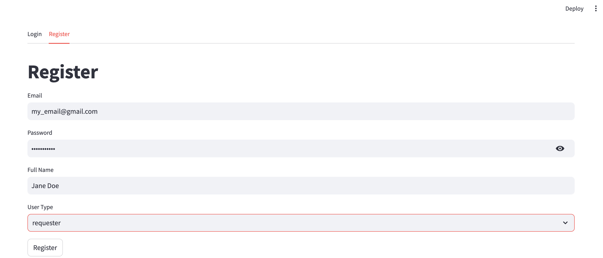
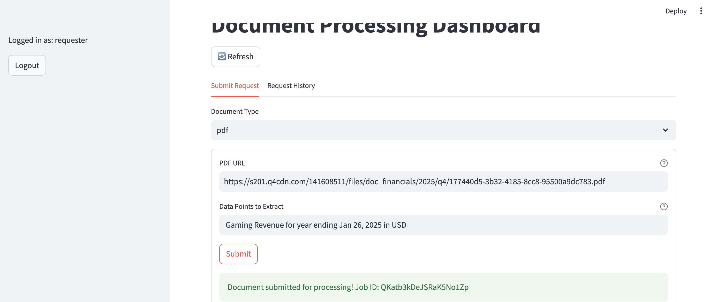

# Sieve UI Quick Start Guide

This document demonstrates how we can use Sieve's simple UI to extract structured data from various document types. We'll cover how to register, login, and perform a data request. 

We will cover an example use case which requests a data point from a PDF document, using Nvidia's latest 10-K report as an example.

## If you don't have an account yet, register one

In your browser, navigate to app.usesieve.com, then click on the Register tab. You should see the following screen. 

Enter your preferred email, password, and full name. Under User Type make sure you select `requester` so you can submit data augmentation requests. See example below. 




## Log in to access the UI

If you have registered, click on the Login tab and enter your username and password that you have registered. Click the Login button to access the product. After you have logged in, you should see the following screen:


## Extract Data From PDF--Nvidia 10-K

### Submit Request

Now you are ready to start using Sieve! Let's extract specific data points from a PDF document. In this example, we will extract gaming revenue from Nvidia's 10k report for the fiscal year ending January 26, 2025. 

To sumbit this request, we will leave "Document Type" set to `pdf`.

Paste Nvidia's 10-K URL, shown below, into the PDF URL field. 

```
https://s201.q4cdn.com/141608511/files/doc_financials/2025/q4/177440d5-3b32-4185-8cc8-95500a9dc783.pdf
```
Under Data Points to Extract, add the text `Gaming Revenue for year ending Jan 26, 2025 in USD`. Click Submit. You should see the page load for a few seconds before it confirms that the document has been submitted for processing. The example request is shown below. 



### Get result

Now that you have submitted a request, the data point is being identified by AI and validated by data professionals. You can watch for your result by clicking on the Request Hisory tab and pressing the Refresh button. Once the data has been retrieved, the status will be updated to complete and the data will be available under Results.


